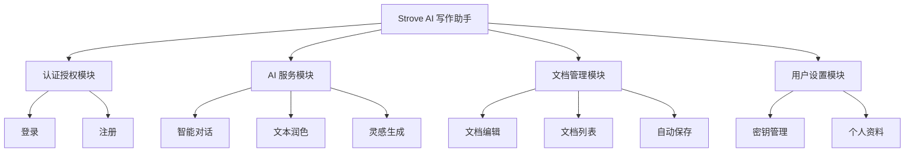

[Strove AI 开发团队]		概要设计说明书
Strove AI 写作助手		1.0.0 | 2025-12-29


<a name="_toc94685087"></a>**概要设计说明书**

**【**Strove AI 写作助手】


<table><tr><th rowspan="7"><p>文件状态：</p><p>[√] 草稿</p><p>[  ] 正式发布</p><p>[  ] 正在修改</p></th><th valign="top">文件标识：</th><th valign="top">STROVE-AI-DOC-HLD</th></tr>
<tr><td valign="top">当前版本：</td><td valign="top">1.0.0</td></tr>
<tr><td valign="top">作    者：</td><td valign="top">Antigravity</td></tr>
<tr><td valign="top">完成日期：</td><td valign="top">2025-12-29</td></tr>
<tr><td valign="top">批 准 人：</td><td valign="top"></td></tr>
<tr><td valign="top">批准日期：</td><td valign="top"></td></tr>
<tr><td valign="top">签    字：</td><td valign="top"></td></tr>
</table>
【Strove AI 开发团队**】**


2

**变更历史**

|**序号**|**版本**|**变更日期**|**变更内容**|**变更者**|
| :-: | :-: | :-: | :-: | :-: |
|1|1.0.0|2025-12-29|创建文档初稿|Antigravity|
|2|||||
|3|||||
|4|||||
|5|||||
|6|||||
|7|||||
|8|||||
|9|||||
|10|||||
|11|||||
|12|||||


目 录

[*模板使用	*i**](#_toc13515)

[**0. 文档介绍	**3****](#_toc12646)

[0.1 文档目的	3](#_toc28509)

[0.2 文档范围	3](#_toc13523)

[0.3 读者对象	3](#_toc22097)

[0.4 参考文档	3](#_toc3180)

[0.5 术语与缩写解释	3](#_toc2507)

[**1. 任务概述	**4****](#_toc9290)

[1.1目标	4](#_toc2020)

[1.2运行环境	4](#_toc17157)

[1.3需求概述	4](#_toc8776)

[1.4条件与限制	4](#_toc19260)

[**2. 总体设计	**4****](#_toc21016)

[2.1体系结构设计	4](#_toc30343)

[2.2功能设计	5](#_toc25506)

[2.3技术架构	5](#_toc15562)

[**3. 界面设计	**5****](#_toc219)

[3.1界面定义及关系图	5](#_toc29501)

[3.2界面资源	6](#_toc6349)

[3.3 A界面原型	6](#_toc18603)

[3.4 B界面原型	6](#_toc21333)

[**4. 接口设计	**7****](#_toc12470)

[4.1 外部接口	7](#_toc31714)

[4.2内部接口	7](#_toc7712)

[**5. 运行部署与维护设计	**7****](#_toc25363)

[5.1运行模块的组合	7](#_toc11363)

[5.2运行控制	7](#_toc30312)

[5.3运行时间	7](#_toc6954)

[5.4部署	7](#_toc1637)

[5.5 维护	8](#_toc21090)

[**6. 出错处理设计	**8****](#_toc14035)

[6.1出错输出信息	8](#_toc7162)

[6.2出错处理对策	8](#_toc12804)

[**7.安全保密设计	**8****](#_toc26772)

[**8.维护设计	**8****](#_toc16202)
# <a name="_toc12646"></a>**0. 文档介绍**
## <a name="_toc28509"></a><a name="_toc521667307"></a>**0.1 文档目的**
本文档旨在对 Strove AI 写作助手项目进行概要设计，明确系统的总体架构、模块划分、接口设计及数据库设计等关键技术方案。为后续的详细设计、编码实现及测试工作提供指导和依据，确保项目开发工作有序进行，最终交付符合需求的高质量软件产品。

## <a name="_toc13523"></a>**0.2 文档范围**
本文档涵盖了 Strove AI 写作助手的总体架构设计、功能模块设计、界面设计、接口设计、运行部署设计以及安全与出错处理设计。文档重点阐述了系统的前后端分离架构、核心业务流程的处理逻辑以及关键技术选型。

## <a name="_toc22097"></a>**0.3 读者对象**
本文档的主要读者对象包括：
- 项目经理：了解系统总体设计，把控项目进度和风险。
- 系统架构师：审核系统架构设计的合理性和可行性。
- 软件开发人员：依据本文档进行详细设计和代码实现。
- 测试人员：依据本文档编写测试计划和测试用例。
- 运维人员：了解系统部署架构，制定运维方案。

## <a name="_toc3180"></a>**0.4 参考文档**
[1] Strove AI 开发团队，软件需求规格说明书，2025-12-25
[2] Strove AI 开发团队，数据库设计说明书，2025-12-29
[3] Spring Boot 官方文档，https://spring.io/projects/spring-boot
[4] Vue.js 官方文档，https://vuejs.org/

## <a name="_toc2507"></a>**0.5 术语与缩写解释**

|**缩写、术语**|**解 释**|
| :-: | :-: |
|SSM|Spring + Spring MVC + MyBatis (本项目实际采用 Spring Boot + JPA)|
|JWT|JSON Web Token，用于用户身份认证|
|API|Application Programming Interface，应用程序接口|
|LLM|Large Language Model，大语言模型|
|Vue|一款用于构建用户界面的 JavaScript 框架|
|MDL|Markdown Language，一种轻量级标记语言|

# <a name="_toc9290"></a>**1. 任务概述**
## <a name="_toc2020"></a>**1.1目标**
开发一款基于 Web 的 AI 写作助手，集成多家主流大模型（如 OpenAI、通义千问等），为用户提供智能对话、文本润色、灵感生成及 Markdown 文档编辑等功能。系统需具备良好的用户体验、较高的数据安全性和可扩展性，满足个人及小团队的日常写作辅助需求。

## <a name="_toc17157"></a>**1.2运行环境**
本系统采用 B/S 架构，运行环境要求如下：

|**类别**|**标准配置**|**最低配置**|
| - | - | - |
|客户端硬件|<p>CPU: Intel Core i5 或同级</p><p>内存：8GB</p><p>显示器：1920x1080 分辨率</p>|<p>CPU: Intel Core i3</p><p>内存：4GB</p>|
|客户端软件|<p>操作系统：Windows 10/11, macOS, Linux</p><p>浏览器：Chrome 90+, Edge 90+, Firefox 88+</p>|<p>浏览器：支持 ES2015+ 的现代浏览器</p>|
|服务器硬件|<p>CPU: 4核</p><p>内存：8GB</p><p>硬盘：100GB SSD</p>|<p>CPU: 2核</p><p>内存：4GB</p><p>硬盘：40GB</p>|
|服务器软件|<p>操作系统：Linux (Ubuntu/CentOS)</p><p>Web服务器：Nginx</p><p>应用服务器：Tomcat (Spring Boot 内置)</p><p>数据库：MySQL 8.0</p><p>容器化：Docker & Docker Compose</p>||
|网络通信|带宽：10Mbps 以上|带宽：2Mbps|

## <a name="_toc8776"></a>**1.3需求概述**
系统主要功能包括：
1.  **用户管理**：注册、登录、个人信息维护。
2.  **密钥管理**：用户自行配置 AI 服务商 API Key，本地加密存储。
3.  **AI 交互**：智能对话、文本润色、灵感生成。
4.  **文档编辑**：Markdown 在线编辑、实时预览、自动保存。
5.  **系统管理**：基础的系统配置与监控。

## <a name="_toc19260"></a>**1.4条件与限制**
1.  **开发周期**：需在规定时间内完成 MVP 版本开发。
2.  **技术栈**：后端强制使用 Java/Spring Boot，前端使用 Vue3。
3.  **成本限制**：尽量使用开源免费的组件和工具。
4.  **网络限制**：服务器需能访问外部 AI 服务商 API（如 OpenAI, 阿里云等）。

# <a name="_toc21016"></a>**2. 总体设计**
## <a name="_toc30343"></a>**2.1体系结构设计**
系统采用经典的前后端分离架构。前端负责页面展示和用户交互，后端负责业务逻辑处理和数据存储。

*【体系结构图】*
```mermaid
graph TD
    Client[客户端浏览器 (Vue3)] -->|HTTP/HTTPS| Nginx[Nginx 反向代理]
    Nginx -->|API 请求| Backend[后端服务 (Spring Boot)]
    Nginx -->|静态资源| Static[静态资源服务器]
    Backend -->|数据读写| DB[(MySQL 数据库)]
    Backend -->|AI 推理请求| AI_Service[外部 AI 服务商 (OpenAI/Aliyun/etc.)]
```

## <a name="_toc25506"></a>**2.2功能设计**
系统主要划分为以下几个功能模块：

1.  **认证授权模块**：负责用户注册、登录、Token 签发与校验。
2.  **AI 服务模块**：封装各 AI 服务商接口，提供统一的对话、润色、灵感生成能力。
3.  **文档管理模块**：处理文档的增删改查、内容存储与版本控制。
4.  **用户设置模块**：管理用户偏好设置及 API 密钥。

*【功能结构图】*


## <a name="_toc15562"></a>**2.3技术架构**
- **前端**：Vue 3, TypeScript, Vite, Element Plus, Pinia, Axios, Marked。
- **后端**：Spring Boot 3.5, Spring Security, Spring Data JPA, Spring AI。
- **数据库**：MySQL 8.0。
- **部署**：Docker, Docker Compose。

# <a name="_toc219"></a>**3. 界面设计**
## <a name="_toc29501"></a>**3.1界面定义及关系图**

<table><tr><th><b>模块名</b></th><th><b>界面名称</b></th><th><b>界面标识</b></th><th><b>功能描述</b></th></tr>
<tr><td rowspan="2">用户认证</td><td>登录页</td><td>Login.vue</td><td>用户输入账号密码登录系统</td></tr>
<tr><td>注册页</td><td>Register.vue</td><td>新用户注册账号</td></tr>
<tr><td rowspan="3">核心功能</td><td>控制台首页</td><td>Dashboard.vue</td><td>展示系统概览及快捷入口</td></tr>
<tr><td>AI 对话页</td><td>ChatInterface.vue</td><td>与 AI 进行实时对话交互</td></tr>
<tr><td>文档编辑器</td><td>EditorView.vue</td><td>Markdown 文档编写与预览</td></tr>
<tr><td>设置</td><td>设置页</td><td>Settings.vue</td><td>配置 API 密钥及个性化选项</td></tr>
</table>

*【界面关系图】*
登录/注册 -> 控制台首页 -> (AI 对话页 | 文档编辑器 | 设置页)

## <a name="_toc6349"></a>**3.2界面资源**
|**序号**|**组件名称**|**版本号**|**功能说明**|
| :-: | :-: | :-: | :-: |
|1|Element Plus|2.11|UI 组件库，提供按钮、表单、弹窗等基础组件|
|2|Marked|17.0|Markdown 解析器，用于文档预览渲染|
|3|Highlight.js|11.9|代码高亮插件|

## <a name="_toc18603"></a>**3.3 A界面原型 - AI 对话页**
*【界面布局图】*
- **左侧**：历史对话列表（可折叠）。
- **中间**：对话内容展示区，气泡式布局。
- **底部**：输入框、发送按钮、常用指令快捷键。
- **右侧**：模型设置及参数调整（可选）。

*【界面功能及操作说明】*
用户在底部输入框输入问题，点击发送或按回车键，系统调用后端 API，AI 回复内容流式输出在中间展示区。用户可对 AI 回复进行复制、重新生成等操作。

## <a name="_toc21333"></a>**3.4 B界面原型 - 文档编辑器**
*【界面布局图】*
- **顶部**：工具栏（加粗、斜体、标题等）、文档标题输入、保存状态指示。
- **左侧**：Markdown 源码编辑区。
- **右侧**：实时预览区。

*【界面功能及操作说明】*
左右分栏布局，左侧输入 Markdown 语法文本，右侧实时渲染 HTML 效果。支持快捷键操作，内容变动自动触发本地及云端保存。

# <a name="_toc12470"></a>**4. 接口设计**
## <a name="_toc31714"></a>**4.1 外部接口**
系统需调用第三方 AI 服务商提供的 API 接口。

|**接口名称**|**OpenAI Chat Completion**|
| :-: | :-: |
|*URL*|*https://api.openai.com/v1/chat/completions*|
|*Method*|*POST*|
|*用途*|*发送用户提示词，获取 AI 模型回复*|
|*认证方式*|*Bearer Token (API Key)*|

## <a name="_toc7712"></a>**4.2内部接口**
系统前后端交互采用 RESTful API。

|***接口名称***|***用户登录***|
| :-: | :-: |
|*URL*|*/api/auth/login*|
|*Method*|*POST*|
|*参数*|*{email, password}*|
|*返回*|*{token, user}*|

|***接口名称***|***发送对话***|
| :-: | :-: |
|*URL*|*/api/ai/chat*|
|*Method*|*POST*|
|*参数*|*{message, model, apiKey}*|
|*返回*|*{reply, usage}*|

|***接口名称***|***保存文档***|
| :-: | :-: |
|*URL*|*/api/documents/{id}*|
|*Method*|*PUT*|
|*参数*|*{title, content}*|
|*返回*|*{success, timestamp}*|

# <a name="_toc25363"></a>**5. 运行部署与维护设计**
## <a name="_toc11363"></a>**5.1运行模块的组合**
客户端浏览器加载 Vue 前端应用，通过 HTTP 请求与 Nginx 交互；Nginx 将 API 请求转发至后端 Spring Boot 应用，静态资源直接返回；后端应用通过 JDBC 连接 MySQL 数据库，通过 HTTP Client 连接外部 AI 服务。

## <a name="_toc30312"></a>**5.2运行控制**
- 使用 Systemd 或 Docker 守护进程管理后端服务进程。
- 前端通过 Nginx 托管。
- 数据库通过 Docker 容器运行。

## <a name="_toc6954"></a>**5.3运行时间**
系统需支持 7x24 小时运行。

## <a name="_toc1637"></a>**5.4部署**
*【部署视图】*
- **应用服务器**：运行 Docker Engine，部署 `strove-backend` 和 `strove-frontend` 容器。
- **数据库服务器**：运行 MySQL 容器（可与应用服务器同机）。

*【部署流程】*
1.  服务器安装 Docker 及 Docker Compose。
2.  拉取代码仓库。
3.  执行 `mvn package` 构建后端 Jar 包。
4.  执行 `npm run build` 构建前端静态资源。
5.  运行 `docker-compose up -d` 启动所有服务。

## <a name="_toc21090"></a>**5.5 维护**
- 提供日志查看接口或通过 `docker logs` 查看容器日志。
- 定期备份 MySQL 数据库数据。
- 通过 Git 进行版本管理和更新。

# <a name="_toc14035"></a>**6. 出错处理设计**
## <a name="_toc7162"></a>**6.1出错输出信息**
后端采用统一的 API 响应格式 `ApiResponse<T>`，无论是成功还是失败，均返回标准 JSON 数据：

**成功响应示例：**
```json
{
  "success": true,
  "message": "操作成功",
  "data": {
    "id": 1,
    "title": "示例通过"
  }
}
```

**失败响应示例：**
```json
{
  "success": false,
  "message": "API Key无效或已过期，请检查您的API Key配置",
  "data": null
}
```
前端 Axios 拦截器会统一拦截非 200 状态码或 `success` 为 `false` 的响应，并通过 Element Plus 的 `ElMessage` 组件弹出错误提示。

## <a name="_toc12804"></a>**6.2出错处理对策**
1.  **全局异常处理**：
    *   后端配置 `GlobalExceptionHandler`，统一捕获 `RuntimeException`、`MethodArgumentNotValidException` 等异常，转换为标准 JSON 错误响应。
    *   针对 `AuthenticationException` 返回 401 状态码，前端自动跳转至登录页。

2.  **AI 服务容错处理**：
    *   **401 Unauthorized**：提示用户检查 API Key 配置。
    *   **429 Too Many Requests**：提示用户请求过于频繁，建议稍后重试。
    *   **5xx Server Error**：提示 AI 服务商暂时不可用。
    *   **超时处理**：`RestTemplate` 设置连接与读取超时，超时后自动抛出异常，避免请求无限挂起。

3.  **前端健壮性**：
    *   关键操作（如保存文档、发送对话）增加 Loading 状态，防止重复提交。
    *   网络断开时，提示用户检查网络连接，并支持本地缓存未保存的文档内容。

# <a name="_toc26772"></a>**7.安全保密设计**
## 7.1 认证与授权
1.  **身份认证**：采用 **JWT (JSON Web Token)** 标准。用户登录成功后，后端签发包含用户 ID 和过期时间的 Token。前端将 Token 存储在 `localStorage` 中，并在后续所有 API 请求的 Header (`Authorization: Bearer <token>`) 中携带。
2.  **接口保护**：Spring Security 配置拦截规则，除登录、注册接口外，其余 `/api/**` 接口均需通过 JWT 过滤器校验。

## 7.2 数据隐私与安全
1.  **API Key 隐私保护（核心）**：
    *   **客户端存储**：用户的第三方 AI 服务商 API Key（如 OpenAI Key）**仅存储在用户浏览器的 LocalStorage 中**，不持久化存储于后端数据库。
    *   **按需传输**：仅在用户发起 AI 对话请求时，API Key 才会随请求参数加密传输至后端内存中临时使用，请求结束后立即释放，最大程度保障用户密钥安全。
2.  **密码安全**：用户登录密码在传输层通过 HTTPS 加密，在数据库层使用 **BCrypt** 强哈希算法加密存储，杜绝明文存储。
3.  **输入过滤**：后端 DTO 层使用 `@Valid` 注解配合 Hibernate Validator 进行参数校验，防止 SQL 注入和非法数据录入。

## 7.3 通信安全
*   全站强制启用 **HTTPS** 协议，确保数据在传输过程中的机密性和完整性，防止中间人攻击。

# <a name="_toc16202"></a>**8.维护设计**
## 8.1 代码管理与规范
*   **版本控制**：使用 Git 进行代码版本管理，遵循 Git Flow 工作流。
*   **后端规范**：遵循阿里巴巴 Java 开发手册，代码结构分层清晰（Controller -> Service -> Repository）。
*   **前端规范**：遵循 Vue 3 风格指南，使用 ESLint + Prettier 进行代码格式化。

## 8.2 构建与部署
*   **后端构建**：使用 **Maven** 进行依赖管理和项目构建 (`mvn clean package`)。
*   **前端构建**：使用 **Vite** 进行快速开发和打包 (`npm run build`)。
*   **容器化部署**：
    *   提供 `Dockerfile` 和 `docker-compose.yml` 文件。
    *   支持一键启动应用、数据库和 Nginx 服务，简化部署流程。

## 8.3 日志与监控
*   **日志记录**：后端集成 **SLF4J + Logback**，按天滚动记录系统日志（Info/Error），关键业务操作（如 AI 调用失败）必须记录详细堆栈信息以便排查。
*   **健康检查**：利用 Spring Boot Actuator 提供的 `/actuator/health` 端点，实时监控应用存活状态和数据库连接情况。
